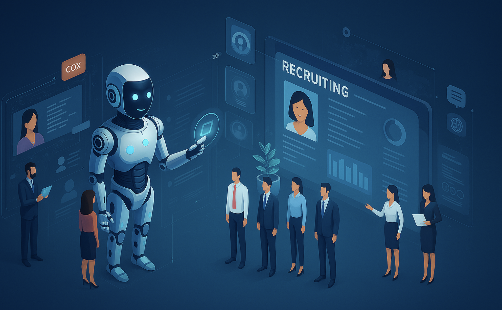
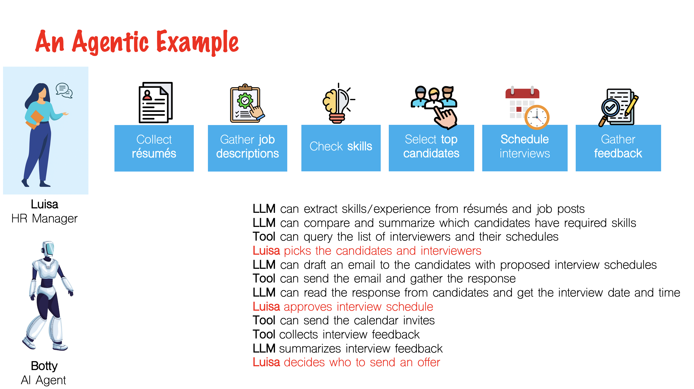

# 🧑‍💼 Agentic HR Management

`Chat with documents` `RAG` `Flows` `Intelligent Document Processing` `Multi-agent orchestration`

## 🤔 The Problem

This is the story of **Luisa**. **Luisa** is an HR manager for a large corporation that's hiring 5,000 employees for their new division. Her struggle is two-fold:

1. **Recruiting candidates** for their open positions
2. **Handling reports** from employees for potential Business Conduct Guidelines violations.

For recruiting, Luisa gets many PDFs with candidate résumés. She has to:

- Check if candidates **fulfill the requirements** of a given position
- Fill in a **table** with the skills/experience of each candidate
- Select **candidates** to be interviewed
- Assign **interviewers** from the team
- Coordinate **interviews** with candidates and interviewers via email
- Schedule **interviews**
- Compile **feedback** from different reviewers
- **Report back** the results to the hiring manager

Luisa would like to make her hiring process more efficiently.

## 🎯 Objective

In this lab you will automate many of the tedious tasks related to recruiting talent in Luisa's organization, as well as providing an AI tool to help Luisa review reports for potential violations to the Business Conduct Guidelines of the company.

## 📈 Business value

Luisa and her team would be able to save hundreds of hours spent scanning résumés and job descriptions manually by leveraging Agentic AI. Also, Luisa will save some time matching which potential sections of the BCG might be infringed in each of the cases she's reviewing.

## 🏛️ The solution

## 📄 Hands-on step-by-step lab

Please use **Chrome** or **Firefox** to access watsonx Orchestrate as Safari is an unsupported browser.

If you do not already have access to a watsonx Orchestrate instance, please refer to the [Instructions for watsonx Orchestrate Free Trial](./instructions-for-wxo-trial.md) guide to create one.

First follow the step-by-step guide [in the Chat with Documents lab guide](/hr-talent/assets/hands-on-lab-hr-manager.md) to learn how you can implement this use case.

Then move on to [the Flow Builder lab guide](/hr-talent/assets/hands-on-lab-hr-manager-flows.md) to learn how to build the agentic workflow for this use case.
