# 🧑‍💼 Digital Me Form Prefilling Lab

## Table of Contents

- [Use case description](#use-case-description)
- [Disclaimer](#disclaimer)
- [Definition of the Form Prefilling Agent](#create-a-new-agent)
- [Trouubleshooting](#troubleshooting)
- [Pulling it all together](#pulling-it-all-together)

## Use Case Description

This lab will guide you through the steps required to implement the first use case of the API Onboarding Proof of Concept, namely form prefilling. The form prefilling use case aims at providing a way to improve user experience of API requesters through an agentic solution that can rely on design gate documents, APIC team documentation, and some other available documents to prefill a significant number of the fields that are part of the Digital Me API request form.


Due to time constraints, we will build an agent able to prefill a couple of fields within a web mockup of the Digital Me API request form by extracting the values from a [PDF export of a previously filled form](assets/sample_form.pdf).

What you'll learn:

- Defines an OpenAPI tool from a REST API endpoint (Initialize Form) that triggers the form prefilling action.
- Defines an agentic workflow to handle file upload, document parsing, and form prefilling using the OpenAPI tool.

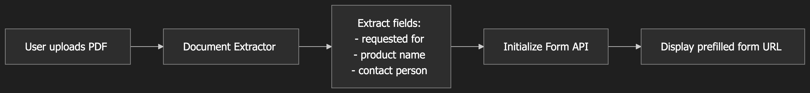

This could help for instance if the user has already filled a lot of information when requesting deployment of the API in the Pre-production environment. Uploading a PDF export of that previously submitted form could help prefill much of the fields of the Production deployment request form.

## Disclaimer

watsonx Orchestrate is a constantly evolving platform and some of the content in this lab may not faithfully reflect the current interface. Please refer to a bootcamp facilitator in case of issue.

## 🥇 Definition of the Form Prefilling Agent

We will now walk you through the steps required to create a form prefilling agent.

### Create a new agent

Open the Agent Builder in watsonx Orchestrate, if you aren't there already -- click on **Build** in the main hamburger menu.


Create a new agent:


Select **Create from scratch**, name it **Form Prefilling Agent**, and give it a short description. Descriptions are used to route a user query to the right agent. You can use the description below:

```
This agent helps prefilling the Digital Me API request form by extracting fields values from documents uploaded by user
```


After clicking **Create**, you will be taken to this screen:


For this agent, we will use the **llama-3-2-90b-vision-instruct** model. You can select it in the **Model** drop-down:


Feel free to experiment with the other model too.

We will leave all the other settings at default values for now. Scroll down to the **Toolset** section. This is where we will be adding our agent tools: a workflow to handle extraction of useful information from documents and a tool to prefill the Digital Me API request form. Click on **Add Tool**:


### Definition of a OpenAPI tool

We will start by defining a tool that will allow agent to trigger prefilling of the Digital Me API request form by invoking a REST api.

In the **Add a tool** modal, select **OpenAPI**:


Download this [OpenAPI definition of the REST api](assets/digital_me_api_wxo_openapi.json).

Then click on **Drag and drop an OpenAPI file here or click to upload** to upload the OpenAPI definition:


Then click on **Next**:


Select the **Initialize Form** operation, then click on **Done** to define the tool:


Once the tool has been defined, click on **Add tool** to define the workflow that will handle extraction of useful information from documents in order to trigger form prefilling.


**Before continuing, try to do it by yourself. If you are stuck, you can ask guidance of a tutor or refer to the solution right below. The flow is supposed to extract values to prefill some form fields such as `requested for`, `product name` and `contact person`**.

### Definition of the form prefilling workflow

Select **Create an agentic workflow**:


Name your agentic workflow **Form Field Values Extraction Workflow**, then click on **Start building**:


Click on **Edit details** to set workflow properties:


In the Overview tab, set a description for the workflow:

```
Extracts significant information from documents uploaded by user in order to prefill the Digital Me API request form
```


In the Parameters tab, click on **Add output** to define an output for the workflow. The output will be the initialized form url, of type **string**:


```
Name: initialized_form_url
Description: url of the prefilled form
```

Click on **Done** to save the settings:


The flow has two nodes only for now - the start node with 0 inputs and 0 variables configured, and the end node with 1 variable configured.

#### We will start by handling file upload

Click on **Add +**, then **User activity**:


Click again on **Add +**, within the User activity block, then **File upload**:

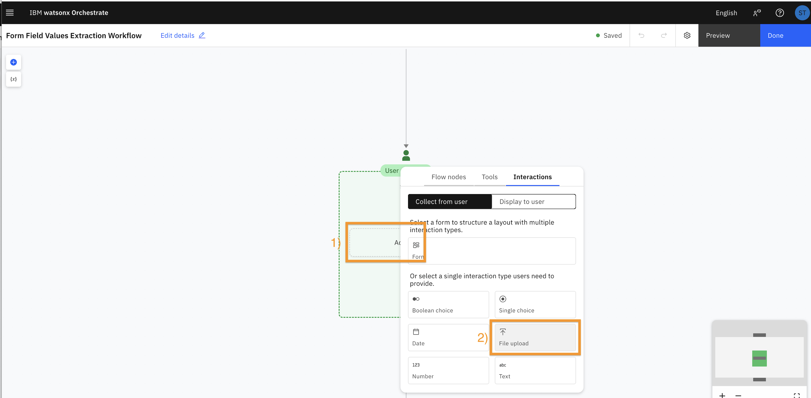

Click on **File upload 1** (1), then on the pencil (2) to rename the component. The name will be the text displayed in chat to inform user about the expected action:

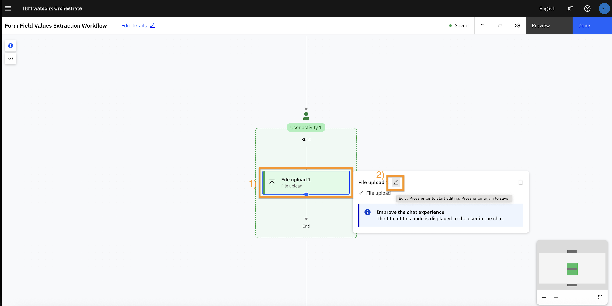

Replace the **File upload 1** name with **Upload document from which field values should be extracted**:

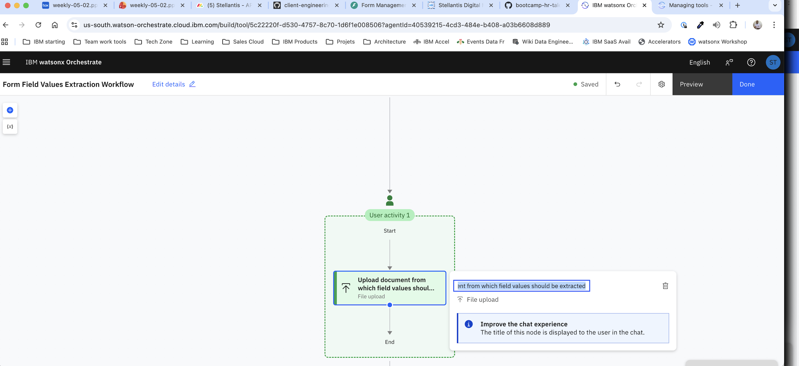

#### Now we will add the logic to extract information from the uploaded document

Hover the arrow outside of the user activity block, then click on **+** followed by **Document extractor**:

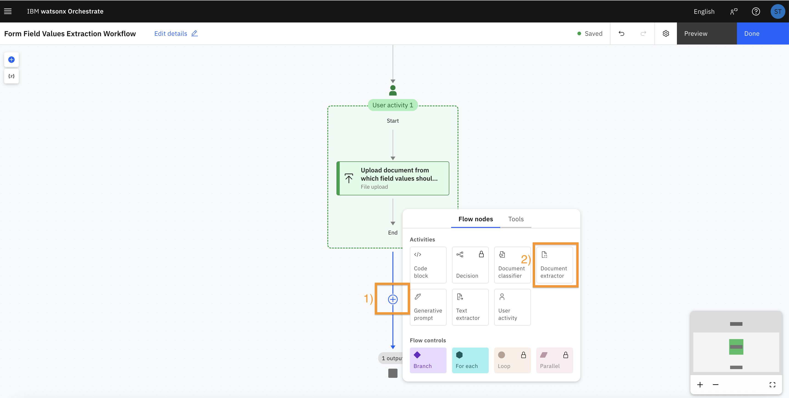

Select **Structured**:

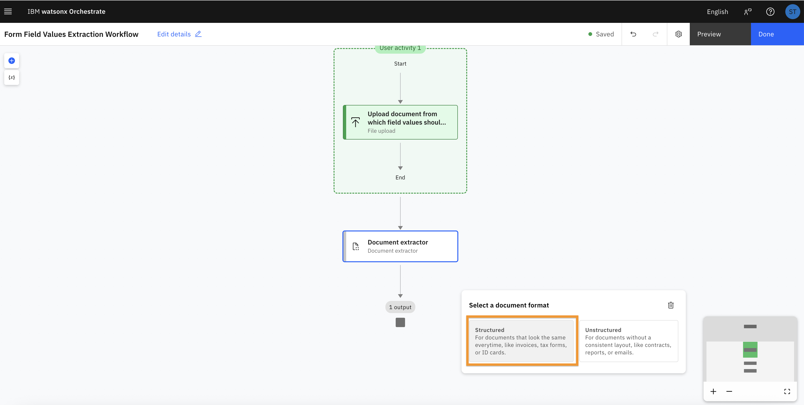

Click on **Drag and drop files here or upload** to upload a sample file that will support training of the file extraction mechanism:

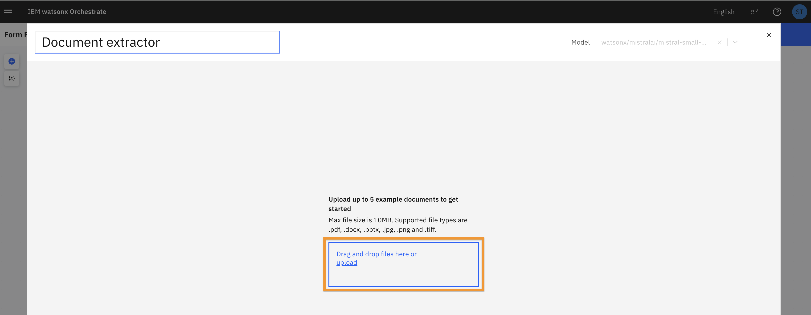

Upload the [**sample_form.pdf**](assets/sample_form.pdf) file:

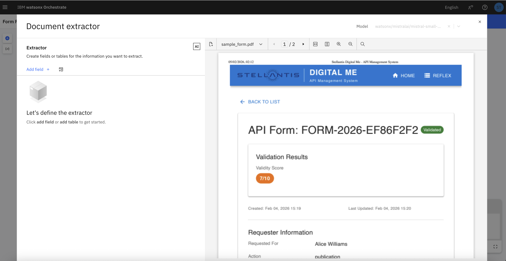

Click on **Add field +** to specify the fields to extract:

Start with `requested for`, `product name` and `contact person`. You can add more fields later if needed:

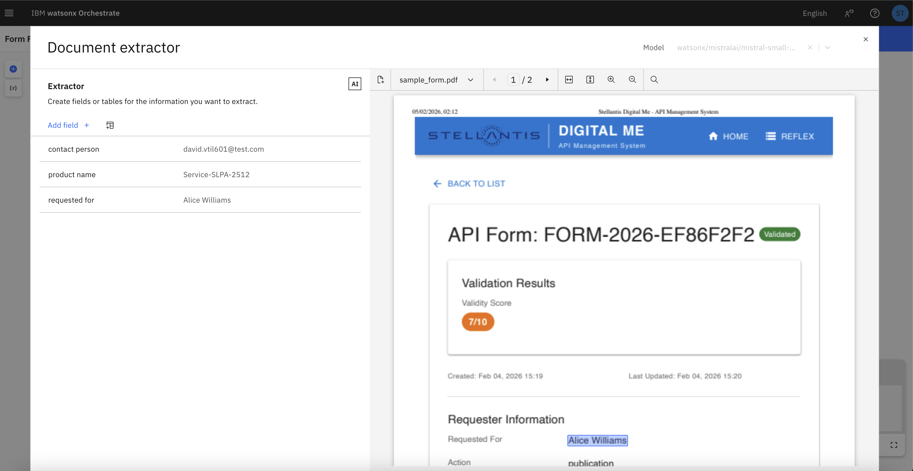

#### Now we will add the logic to trigger the form prefilling API

Hover the arrow right after the document extractor block, then click on **+**, open **Tools**, then click on the **Initialize Form** tool:

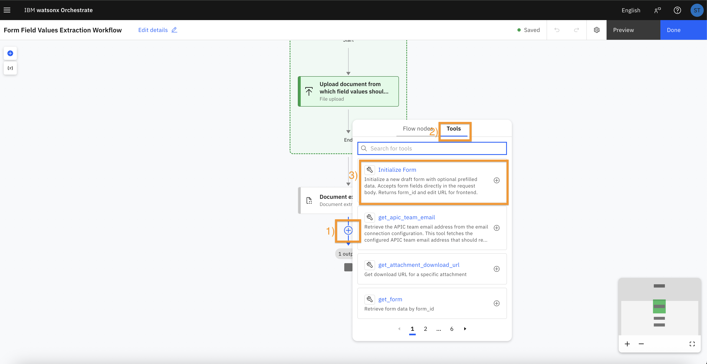

#### Let's end with the logic to display the initialized form url

Hover the arrow right after the **Initialize Form** tool block, then click on **+**, then on **User activity**:

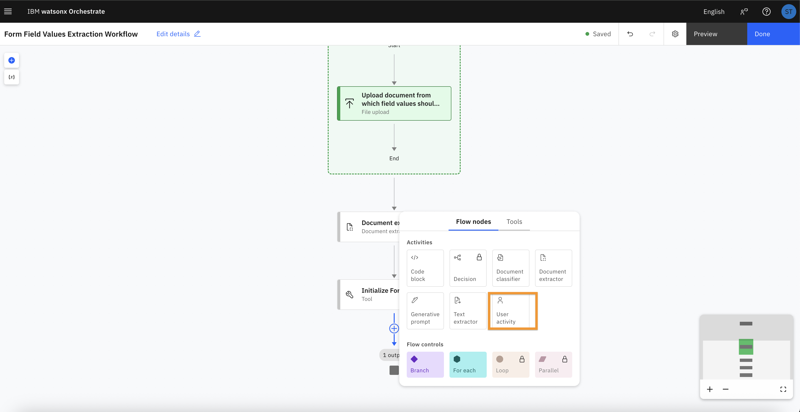

Add a **Message** widget to display a message to user:

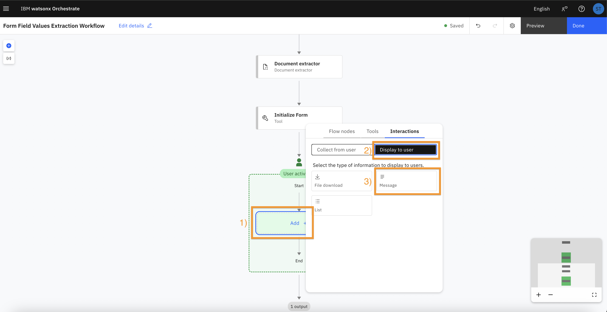

Click on the **Message 1** widget, then change the **Output message** to the following:

```
The form has been successfully initialized with id {flow["Initialize Form"].output.form_id}. Click here ({flow["Initialize Form"].output.edit_url}) to access and complete it.
```

You can use the **{x}** button to select the relevant variable:

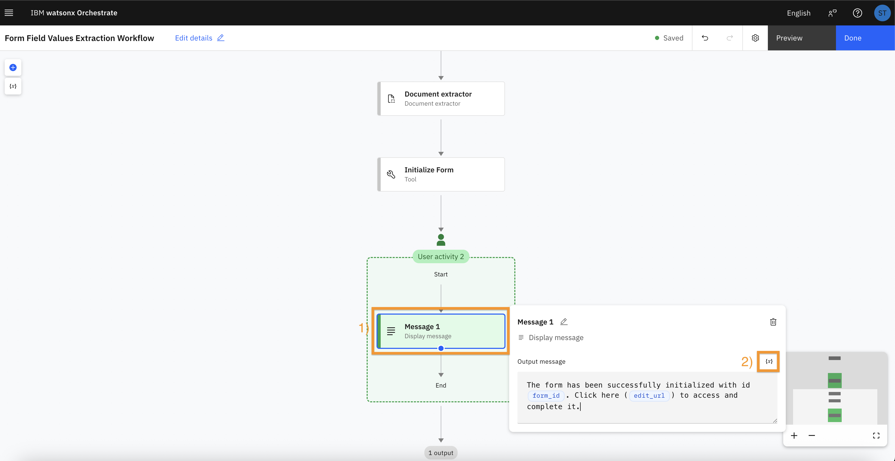

When finished, click on **Done** to close the flow builder.

#### Let's test the flow

Type `I want to initialize an API request form using values extracted from a document` in the chat, then click to submit:

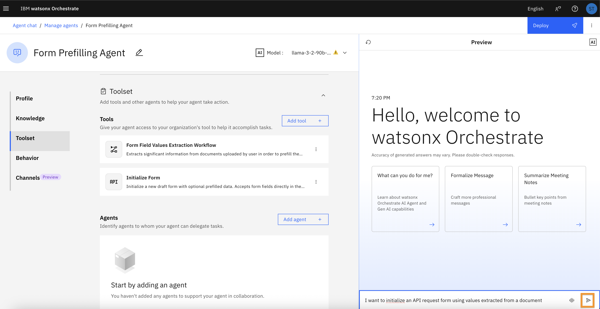

Click **Add file** to upload the [**sample_form.pdf**](assets/sample_form.pdf) file (for the test, we will use the same file as when configuring the form extractor, but the flow should work with any PDF file having the same structure):

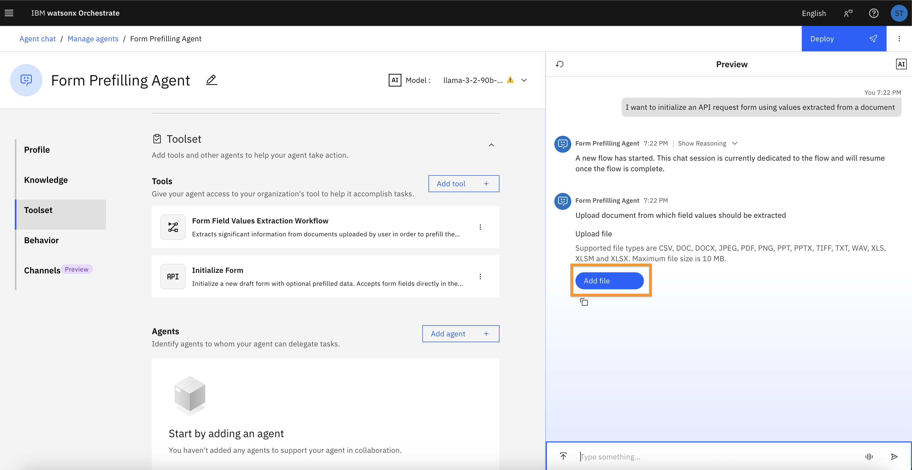

Submit the file to pursue the flow execution:

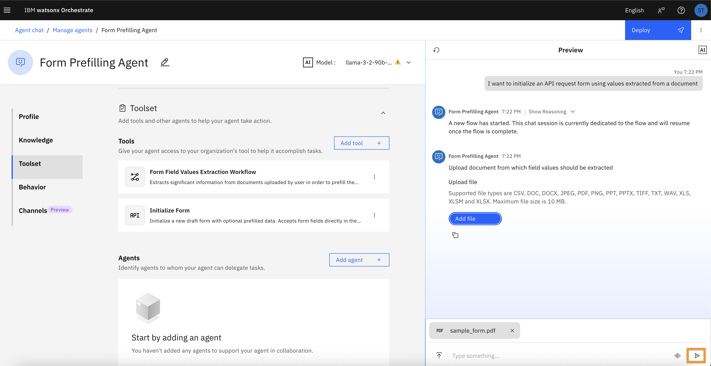

The form has been initialized:

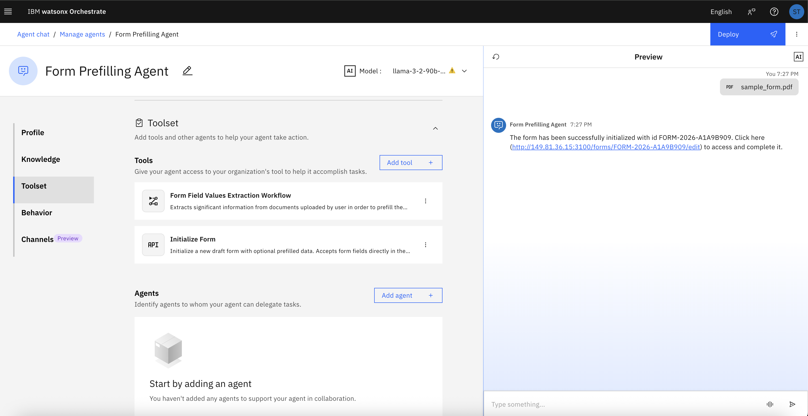

You can click on the link to access and complete it:

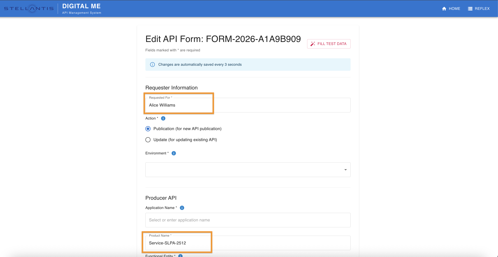

## Troubleshooting

By default, watsonx Orchestrate uses AI to determine node inputs. In case of issue when executing the flow, you can try to specifiy node inputs.

To specify node inputs, click on a node, then click on **Edit data mapping**:

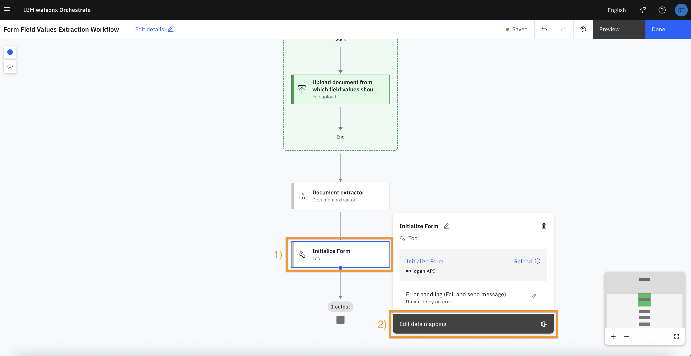

Click on the **variable** icon (**{x}**) to choose the relevant variable.

## Pulling it all together

This lab demonstrates building an AI-powered form prefilling agent using watsonx Orchestrate to automatically populate fields in a Digital Me API request form by extracting data from uploaded documents (specifically PDF files). The solution leverages AI to analyze the document structure and content, then maps the extracted information to the corresponding fields in the form. This approach streamlines the process of gathering and submitting data, reducing manual effort and minimizing errors.

What you've learned:

- Defines an OpenAPI tool from a REST API endpoint (Initialize Form) that triggers the form prefilling action.
- Defines an agentic workflow to handle file upload, document parsing, and form prefilling using the OpenAPI tool.


