# 🧑‍💼 Digital Me Form Prefilling Lab

## Table of Contents

- [Use case description](#use-case-description)

## Use Case Description

This lab will guide you through the steps required to implement the first use case of the API Onboarding Proof of Concept, namely form prefilling. The form prefilling use case aims at providing a way to improve user experience of API requesters through an agentic solution that can rely on design gate documents, APIC team documentation, and some other available documents to prefill a significant number of the fields that are part of the Digital Me API request form.

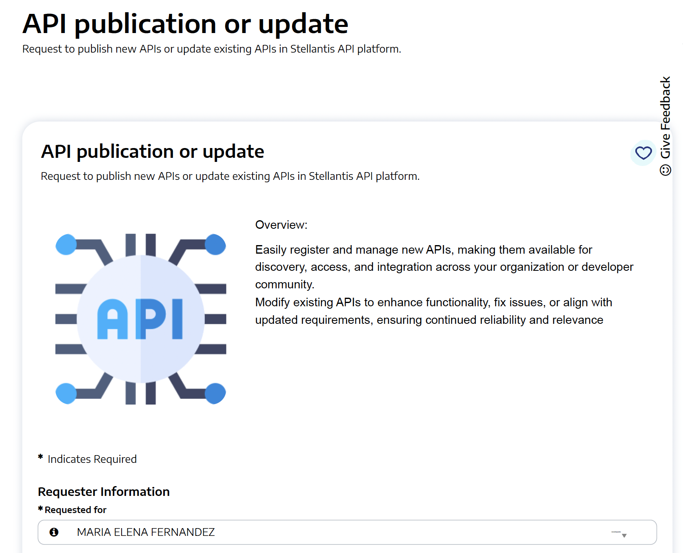

Due to time constraints, we will build an agent able to prefill a couple of fields within a web mockup of the Digital Me API request form by extracting the values from a [PDF export of a previously filled form](assets/sample_form.pdf).

## Disclaimer

watsonx Orchestrate is a constantly evolving platform and some of the content in this lab may not faithfully reflect the current interface. Please refer to a bootcamp facilitator in case of issue.

## 🥇 Form Prefilling Agent
We will now walk you through the steps required to create a form prefilling agent.

### Create a new agent

Open the Agent Builder in watsonx Orchestrate, if you aren't there already -- click on **Build->Agent Builder** in the main hamburger menu.


Create a new agent:


Select **Create from scratch**, name it **Form Prefilling Agent**, and give it a short description. Descriptions are used to route a user query to the right agent. You can use the description below:

```
This agent helps prefilling the Digital Me API request form by extracting fields values from documents uploaded by user
```

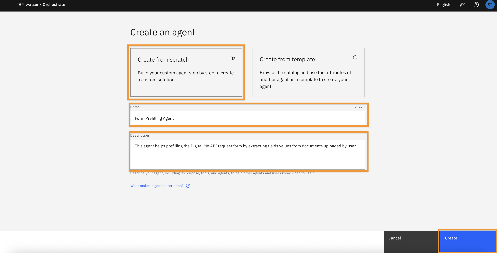

After clicking **Create**, you will be taken to this screen:

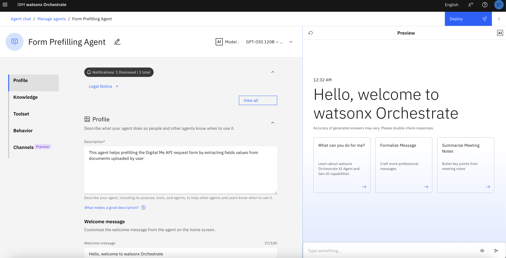

For this agent, we will use the **llama-3-2-90b-vision-instruct** model. You can select it in the **Model** drop-down:

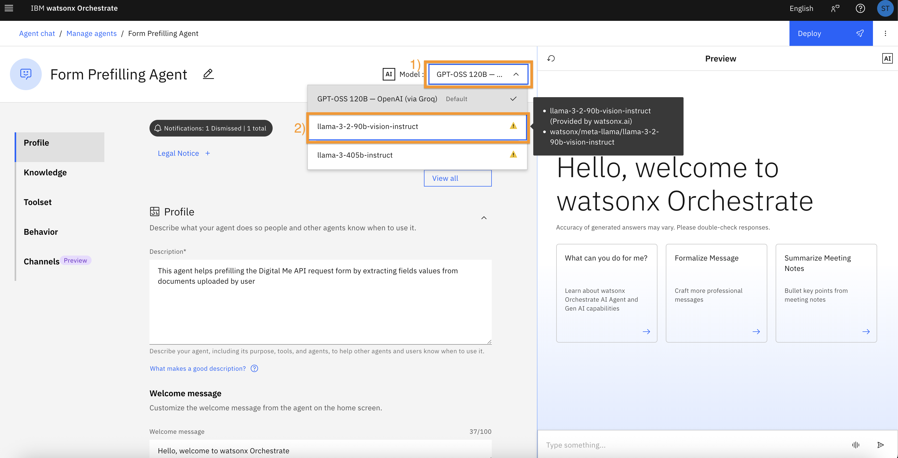

Feel free to experiment with the other model too.

We will leave all the other settings at default values for now. Scroll down to the **Toolset** section. This is where we will be adding our agent tools: a workflow to handle extraction of useful information from documents and a tool to prefill the Digital Me API request form. Click on **Add Tool**:

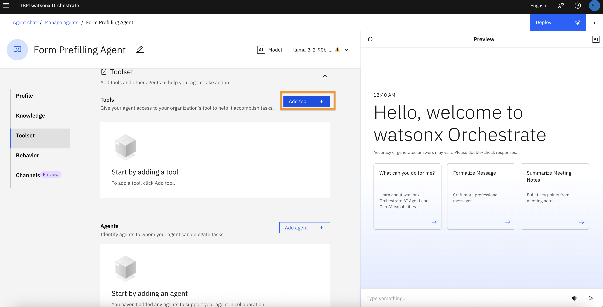

### Definition of a OpenAPI tool
We will start by defining a tool that will allow agent to trigger prefilling of the Digital Me API request form by invoking a REST api.

In the **Add a tool** modal, select **OpenAPI**:

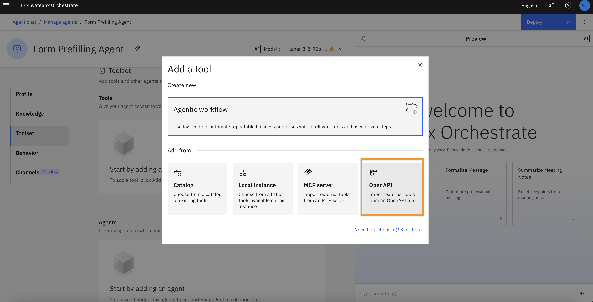

Download this [OpenAPI definition of the REST api](assets/digital_me_api_wxo_openapi.json).

Then click on **Drag and drop an OpenAPI file here or click to upload** to upload the OpenAPI definition:

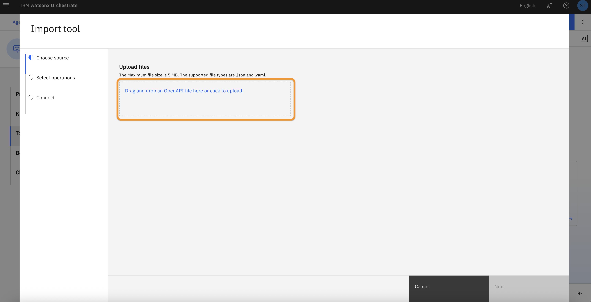

Then click on **Next**:

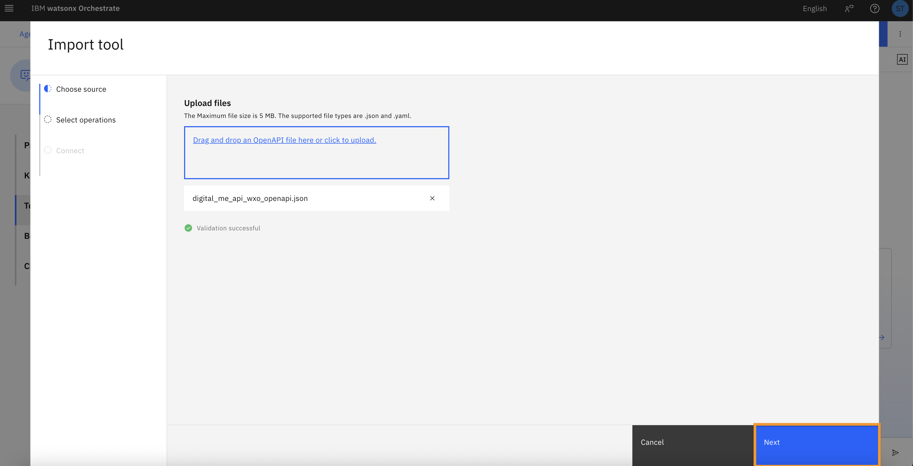

Select the **Initialize Form** operation, then click on **Done** to define the tool:

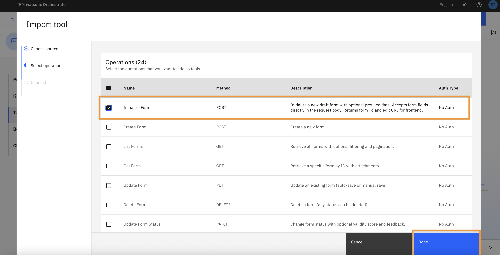

Once the tool has been defined, click on **Add tool** to define the workflow that will handle extraction of useful information from documents in order to trigger form prefilling.

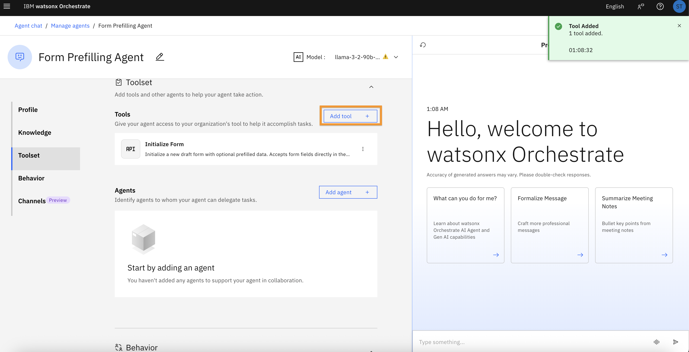

### Definition of the form prefilling workflow

Select **Create an agentic workflow**:

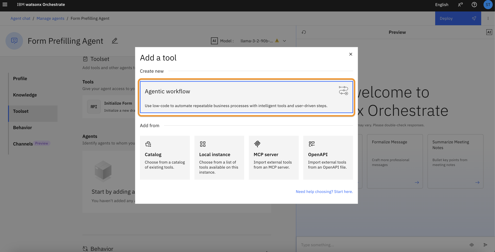

Name your agentic workflow **Form Field Values Extraction Workflow**, then click on **Start building**:

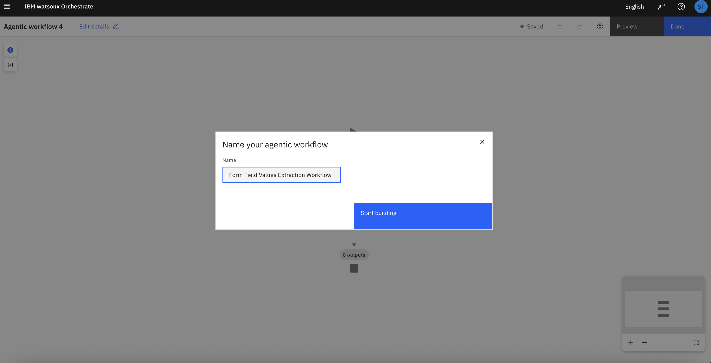

Click on **Edit details** to set workflow properties:

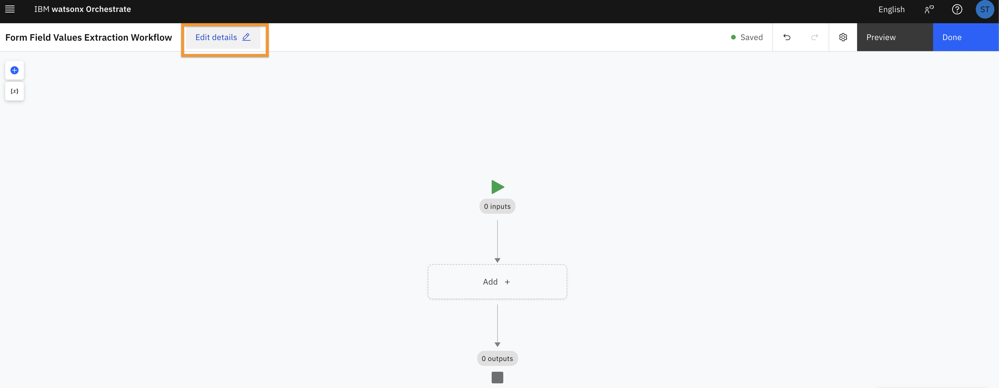

In the Overview tab, set a description for the workflow:

```
Extracts significant information from documents uploaded by user in order to prefill the Digital Me API request form
```

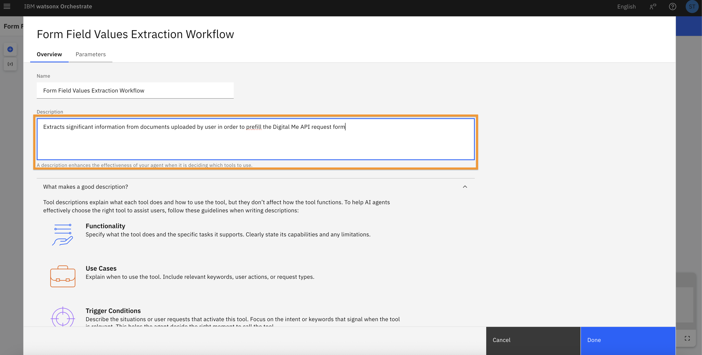

In the Parameters tab, click on **Add output** to define an output for the workflow. The output will be the initialized form url, of type **string**:

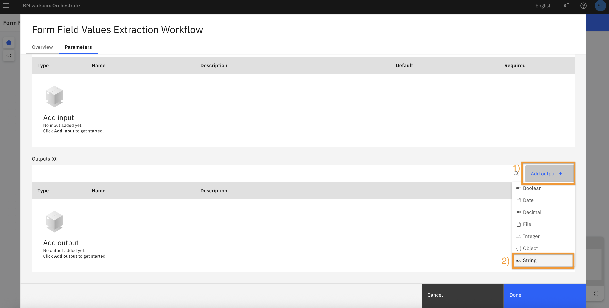

```
Name: initialized_form_url
Description: url of the prefilled form
```

Click on **Done** to save the settings:

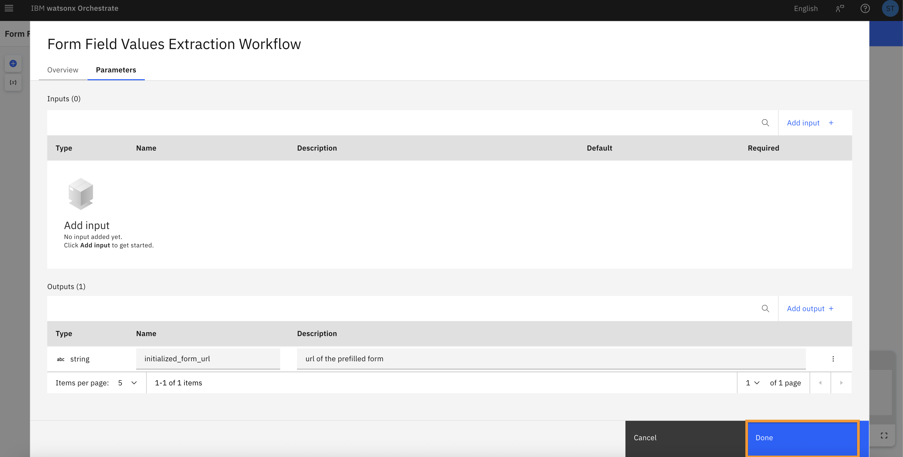

The flow has two nodes only for now - the start node with 0 inputs and 0 variables configured, and the end node with 1 variable configured. 

We will start by handling file upload. Click on **Add +**, then **User activity**:

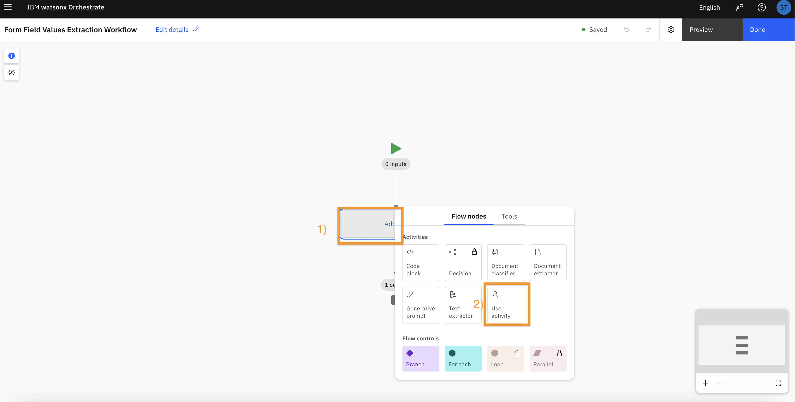